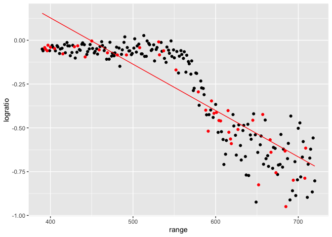

cross_validation
================
Yifei Yu
2024-10-29

``` r
set.seed(1)
```

look at LIDAR data

``` r
data("lidar")

lidar_df = 
  lidar |> 
  as_tibble() |> 
  mutate(id = row_number())
```

``` r
lidar_df |> 
  ggplot(aes(x = range, y = logratio)) + 
  geom_point()
```

<!-- -->

## Try to do CV

We will compare three models – one linear, one smooth, one wiggly.

Construct training and testing df

``` r
train_df = sample_frac(lidar_df, size = 0.8)
test_df = anti_join(lidar_df, train_df, by = "id")
```

Look at these.

``` r
ggplot(train_df, aes(x = range, y = logratio)) + 
  geom_point() +
  geom_point(data = test_df, color = "red")
```

<!-- -->

Fit three models.

``` r
linear_mod = lm(logratio ~ range, data = train_df)
smooth_mod = gam(logratio ~ s(range), data = train_df)
wiggly_mod = gam(logratio ~ s(range, k = 30), sp = 10e-6, data = train_df)
```

Look at fits

``` r
train_df |> 
  add_predictions(linear_mod) |> 
  ggplot(aes(x = range, y = logratio)) +
  geom_point() +
  geom_point(data = test_df, color = "red") +  
  geom_line(aes(y = pred), color = "red")
```

<!-- -->

``` r
train_df |> 
  add_predictions(wiggly_mod) |> 
  ggplot(aes(x = range, y = logratio)) +
  geom_point() +
  geom_point(data = test_df, color = "red") +
  geom_line(aes(y = pred), color = "red")
```

<!-- -->

``` r
train_df |> 
  add_predictions(smooth_mod) |> 
  ggplot(aes(x = range, y = logratio)) +
  geom_point() +
  geom_point(data = test_df, color = "red") +
  geom_line(aes(y = pred), color = "red")
```

<!-- -->

Compare these numerically using RMSE.

``` r
rmse(linear_mod,test_df)
```

    ## [1] 0.127317

``` r
rmse(smooth_mod,test_df)
```

    ## [1] 0.08302008

``` r
rmse(wiggly_mod,test_df)
```

    ## [1] 0.08848557

## Repeat the train/test split
